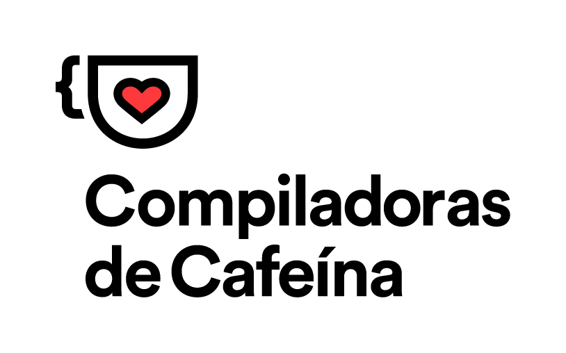

<p align="center">

</p>

# Plataforma - Compiladoras de Cafeína

Olá! Seja muito bem-vinda ao repositório da Plataforma das Compiladoras de Cafeína! Estamos muito felizes com o seu interesse em contribuir com a nossa comunidade!

## Como posso executar esse projeto?

### O que eu preciso ter instalado para executar o projeto?

- [NodeJS](https://nodejs.org/en/download/)
- [Yarn](https://yarnpkg.com/getting-started/install)
- Editor de texto da sua preferência

### Passo a passo de instalação

Siga os seguintes passos no terminal para executar o nosso projeto:

1. Clone este repositório na sua máquina

```
git clone https://github.com/compiladoras/Plataforma.git
```

2. Entre na pasta do projeto e execute o comando abaixo para instalar as dependências necessárias

```
yarn
```

3. Para contribuir com o nosso projeto você precisa estar na branch `develop`

```
git checkout develop
```

4. Após a instalação e certificando-se de que está na branch correta, execute o comando abaixo

```
yarn start
```

5. Agora é só contribuir! 🥳

### Passo a passo para execução de testes

Quando quiser executar os testes da aplicação basta executar o comando:

```
yarn test
```

## Pull Request Template

Nós priorizamos a padronização e organização dos nossos projetos, por isso trabalhamos com _pull request templates_ para facilitar a comunicação entre nós e a revisão do código por nossas companheiras de time. Quando você abrir um _pull request_ lembre-se de preencher o nosso template com bastante carinho. Nós agradecemos muito! ❤️

## Quais tecnologias nós usamos?

Aqui nós trabalhamos com:

- React
- Typescript
- Jest
- Styled Components

_____

Estamos muito felizes por você estar conosco!

Abraços,


